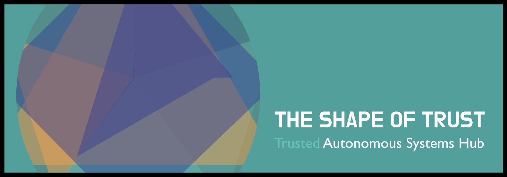
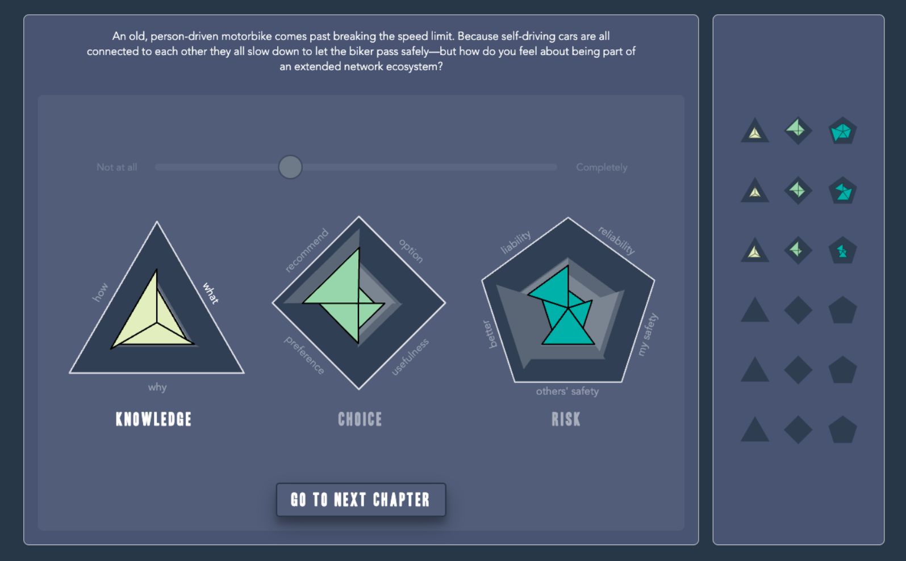
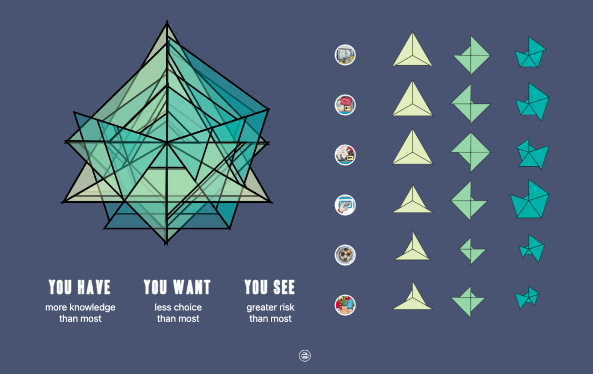
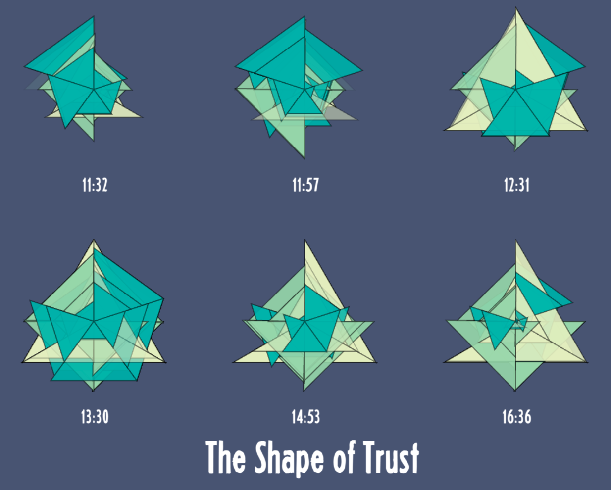

# The shape of trust
</a>

This was a project in collaboration with the Imagination Lab at Lancaster University.  It seeks to bridge the gap between engineers and laypeople's understanding of autonomous AI systems. It presents a set of scenarios that participants are asked to respond to; seeking answers across dimensions of knowledge, choice and risk.  At the end users are presented with a composite shape that represents their particular view on autonomous AI.

You can see a live version of the project <a href="https://trustme-liart.vercel.app/">here</a>

## Feedback screen
</a>

## Results screen
</a>

## Gallery screen
</a>
